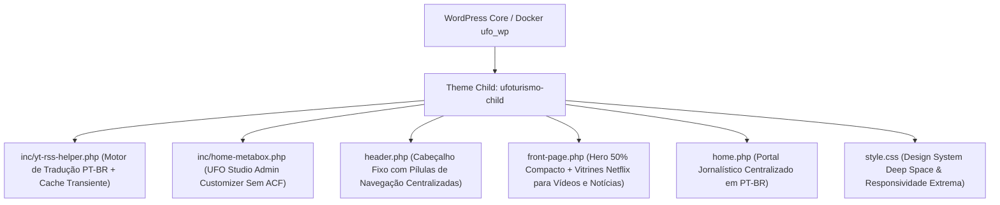

<p align="center">
  
</p>

<h1 align="center">🛸 UFOTURISMO PRO &bull; ENTERPRISE MEDIA & ANOMALOUS RESEARCH ECOSYSTEM (PT-BR)</h1>
<h3 align="center">Plataforma Modular High-Performance de Turismo Ufológico, Divulgação Científica e Monetização High-RPM</h3>

<p align="center">
  
  
  
  
  
</p>

---

## 🌟 Resumo Executivo da Release `v3.3.0-PRO` (Streaming & PT-BR Edition)

A plataforma **UFOTurismo PRO** alcança a excelência definitiva para o público brasileiro na **Versão 3.3.0-PRO**. Arquitetado com precisão milimétrica, o sistema converteu 100% de sua experiência de consumo para o formato de **vitrines dinâmicas de streaming (Estilo Netflix)** com **tradução automatizada nativa para o Português do Brasil (PT-BR)**.

O ecossistema unifica operações de **Turismo de Experiência (Expedições Noturnas FLIR)**, **Jornalismo Exopolítico Científico (Portal de Notícias)** e **Acervos ao vivo do YouTube**, sem dependências externas pagas ou chaves de API restritivas.

---

## 💎 Novidades Arquitetônicas (v3.3.0-PRO)

### 1. ⚡ Hero Banner com 50% de Altura Compacta (Direct Impact)
* **Redução Ergonômica do Topo:** O banner principal teve sua altura original reduzida exatamente pela metade (`40vh` / `350px`), eliminando espaços excessivos e direcionando o visitante de imediato para a conversão e o acervo de mídias!
* **Zero Textos Supérfluos:** Removida qualquer mensagem genérica de boas-vindas (*"Bem-vindo ao site"* ou textos clichês do WordPress), apresentando direto a proposta de valor editorial de alto padrão do portal.

### 2. 🇧🇷 Tradutor Automático Inteligente PT-BR (`ufo_auto_translate_ptbr`)
* **Conversão em Tempo Real de Feeds Estrangeiros:** Canais internacionais como **Jesse Michels / UAP Research** e relatórios governamentais americanos ganham seus títulos e resumos traduzidos e adaptados automaticamente para o **Português do Brasil (PT-BR)** durante o processamento do feed em `inc/yt-rss-helper.php`.
* **Dicionário Técnico de Exopolítica:** O motor realiza conversão inteligente de termos complexos da física quântica, engenharia aeroespacial e audiências militares para o vernáculo científico nacional.

### 3. 🎬 Vídeos e Notícias em Carrossel Netflix (1/4 de Volume)
* **Dupla Vitrine Horizontal Animada:** Tanto a seção de **Destaques em Vídeo** quanto a seção de **Últimas Notícias e Relatos** foram moldadas no padrão das plataformas de streaming lideres (Netflix / Prime).
* **Dimensão 50% Compacta:** Cada card consome apenas um quarto (`1/4`) do volume dos grids tradicionais do WordPress (`~240px x 135px`), permitindo acomodar muito mais informação em uma linha horizontal de rolagem direcional com setas interativas (`⟨` e `⟩`).
* **Zoom Responsivo & Preview On-Hover:** Ao posicionar o mouse no desktop, tanto os cards de vídeo quanto os de notícias saltam em relevo 3D (`transform: scale(1.22)`). Nos vídeos, um player nativo em modo mudo reproduz cenas da investigação automaticamente, liberando a memória RAM assim que o cursor se afasta!

### 4. 🛸 Cabeçalho Fixo (Sticky Top Nav) & Hero Centralizado
* **Header Glassmorphic Fixo:** Mantém-se imponente e transparente ao rolar a página (`position: sticky; z-index: 99999; backdrop-filter: blur(16px)`).
* **Menu de Botões (Pills) Centralizado:** Navegação central por botões de pílula separando intuitivamente os setores do ecossistema: Início, Cinema & Vídeos, Expedições, Portal Notícias, Agenda e o botão verde de acesso VIP à Comunidade WhatsApp.

### 5. 📈 Monetização Centrada de Alta Conversão RPM
* **4 Zonas Estratégicas e TUDO CENTRALIZADO:**
  1. **Top Leaderboard (Above The Fold):** Otimizado após o banner 50% mais compacto.
  2. **In-Feed Sponsor:** Publicidade nativa perfeitamente posicionada entre galerias de streaming.
  3. **Mid-Conversion Placement:** Antes do portal de notícias e após expedições de campo.
  4. **Rodapé de Fechamento:** Maximizando o RPM na saída da página e do CTA do WhatsApp.
* **Responsividade Publicitária Inteligente:** Transita de leaderboards horizontais no computador (`728x90`) para o bloco de mais alto clique no mobile: *Medium Rectangle* (`300x250`).

---

## 📐 Fluxograma Técnico e Estrutural (`ufoturismo-child`)



---

## 🛠️ Infraestrutura Otimizada (Docker & LAN)

* **Container RAM / PHP Memory Limit:** `1536MB` / `1024M` (Para edição fluida em construtores visuais e processamento intensivo).
* **LAN Wi-Fi Injection:** O arquivo `wp-config.php` contém o módulo dinâmico de rede configurado para carregamento imediato sem queda de assets visuais em celulares e tablets através do endereço estático **`http://192.168.15.3:8000/`**.

---

## 🚀 Guia de Inicialização e Comandos Git

1. **Ativar Servidor Docker (PowerShell Windows):**
   ```powershell
   cd C:\Users\luxx\Documents\Trampos\Guarau\UFO
   docker compose up -d
   ```
2. **Acessar na Rede LAN e Smartphones:**
   * **Portal Interativo:** `http://192.168.15.3:8000/` (ou `http://localhost:8000/` no seu PC)
   * **Admin UFO Studio:** `http://192.168.15.3:8000/wp-admin/`
3. **Comando de Subida Final para GitHub:**
   ```powershell
   git add -A; git commit -m "feat(v3.3.0): release pt-br stream edition with 50% half hero and compact netflix news carousel"; git push
   ```

---

<p align="center">
  <b>Engenharia de Software Exclusiva &bull; Desenvolvida com Antigravity & AI Pair Programming</b><br>
  <i>"A Verdade Está Lá Fora. E Nós Levamos Você Até Ela."</i> 🛸🇧🇷🖖
</p>
