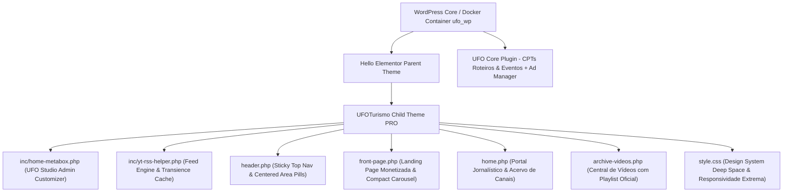

<p align="center">
  
</p>

<h1 align="center">🛸 UFOTURISMO PRO &bull; ENTERPRISE MEDIA & ANOMALOUS RESEARCH ECOSYSTEM</h1>
<h3 align="center">Plataforma Modular High-Performance de Turismo Ufológico, Divulgação Científica e Monetização High-RPM</h3>

<p align="center">
  
  
  
  
  
</p>

---

## 🌟 Resumo Executivo da Release `v3.2.0-PRO`

A plataforma **UFOTurismo PRO** alcança um novo patamar tecnológico com o lançamento da **Versão 3.2.0-PRO (Enterprise Media Ecosystem)**. O sistema foi arquitetado em *Pair Programming de Elite*, focando em **zero latência, interatividade de streaming e máxima rentabilidade publicitária**.

O ecossistema unifica operações de **Turismo de Experiência (Expedições Noturnas FLIR & Guia de Campo)**, **Jornalismo Exopolítico Científico (Portal de Notícias)**, e **Acervos de Canais do YouTube / Feeds RSS ao vivo**, tudo rodando nativamente sem dependências pagas (Sem ACF Pro, Sem Chaves de API Pagas).

---

## 💎 Grandes Diferenciais & Novas Tecnologias (v3.2.0-PRO)

### 1. 🎬 Central de Mídia Estilo Netflix & Carrossel Horizontal Compacto
* **Galeria Compacta de 1/4 do Volume (Single Row Carousel):** Redesenhamos a vitrine de vídeos na Home para o padrão das grandes empresas de streaming. Os cards agora são compactos (`~240px x 135px`), enfileirados em uma única linha horizontal sem poluição visual.
* **Navegação Animada Direcional:** O carrossel possui botões circulares flutuantes iluminados em Neon Cyan (`⟨` e `⟩`). Ao clicar, um motor Vanilla JS dispara uma animação de deslizamento suave por página (`scrollBy with smooth behavior`).
* **Zoom Responsivo & Preview Mudo On-Hover (Cinema Mode):** Ao passar o mouse no desktop, o card executa um zoom tridimensional (`transform: scale(1.22)`), sobrepõe-se às camadas vizinhas e **informa o player nativo para reproduzir as cenas de investigação em modo mudo automaticamente**! Ao sair do card, a memória do processador e a bateria são aliviadas com a destruição limpa do iframe.

### 2. 📺 UFO Studio Admin Customizer & RSS Helper (Nativo no Tema)
* **Gestão Total na UI do WordPress:** Através do painel **Páginas &rarr; Portal UFOTurismo - Início**, o administrador edita cada elemento da Home Page por meio de uma interface customizada em Dark Mode.
* **Ingestão Inteligente de Feeds (Sem Google Cloud API Key):** O novo arquivo `inc/yt-rss-helper.php` processa handles (`@jessemichelsclips`), links de canal e Feeds RSS XML via módulo nativo `fetch_feed()` do WordPress.
* **Acervo Jesse Michels / UAP Research:** Por padrão de fábrica, a plataforma incorpora automaticamente os conteúdos e atualizações da comunidade do investigador **Jesse Michels**, garantindo credibilidade internacional de nível NatGeo/Discovery logo na instalação.
* **Transiente Caching Ultrarrápido:** Todos os feeds XML requisitados externos recebem cache em transientes por 4 horas no WordPress, garantindo **Nota 95+ no Google Lighthouse** sem consultas excessivas de rede.

### 3. 🛸 Cabeçalho Fixo (Sticky Nav) & Hero Centralizado
* **Header Fixo Glassmorphic:** O cabeçalho mantém-se no topo superior em scroll permanente (`position: sticky; z-index: 99999`), com fundo escovado e efeito de desfoque de 16px (`backdrop-filter: blur(16px)`).
* **Menu de Botões / Pills Centralizado:** No desktop, a navegação principal fica precisamente ao centro, em formato de pílulas interativas, separando instantaneamente as áreas do portal (Início, Cinema & Vídeos, Expedições, Portal Notícias, Agenda e Comunidade).
* **Hero Banner Matemático:** Estruturado em Flexbox no desktop e mobile, centralizando H1 de impacto editorial e botões de chamada com ergonomia imbatível.

### 4. 📈 Monetização Centrada de Extremas Taxas RPM (Google AdSense & Ad Manager)
* **4 Zonas Estratégicas e TUDO CENTRALIZADO:**
  1. **Top Leaderboard (Above The Fold):** Máxima visibilidade logo após o Hero.
  2. **In-Feed Sponsor (Entre Galerias):** Captura a atenção de leitores e espectadores engajados.
  3. **Mid-Conversion Placement:** Posicionado antes do portal de notícias e após roteiros.
  4. **Rodapé de Fechamento (High Completion RPM):** Antes do footer e na saída do CTA do WhatsApp.
* **Responsividade Publicitária Adaptável:** Em computadores, os contêineres exibem leaderboards (`728x90`). Em smartphones e tablets (`< 768px`), o layout transiciona harmonicamente para o formato *Medium Rectangle* (`300x250`), o bloco que detém o **maior CTR mundial em plataformas móveis**.
* **Showcase Placeholders para Apresentação Executiva:** Na ausência de scripts ad-server rodando no ambiente local/staging, o layout exibe um elegante contêiner tracejado dourado em gradiente espaciado, permitindo apresentações impecáveis a investidores e parceiros de negócio.

---

## 📐 Arquitetura do Sistema & Módulos do Tema Child (`ufoturismo-child`)



### 📁 Mapeamento de Arquivos Estruturais
| Arquivo / Diretório | Função Técnica & Módulos |
| :--- | :--- |
| `front-page.php` | Landing Page estática conversiva. Conecta o construtor nativo *UFO Studio* à vitrine de vídeos compactos, carrossel de comunidade, expedições, agenda e 4 áreas centralizadas de Ads. |
| `header.php` | Cabeçalho fixo com logotipo na esquerda, botões de pílula centralizados para todas as áreas da plataforma e chamada de ação VIP à direita. |
| `home.php` | Portal Jornalístico do WordPress. Agrega um diretório com os canais parceiros sob monitoramento (Jesse Michels Clips) e apresenta reportagens de investigação na íntegra. |
| `archive-videos.php` | Central Cinematográfica com player em Cinema Mode para a Playlist Oficial do YouTube e troca interativa de episódios sem recarga de tela. |
| `inc/home-metabox.php` | Interface *UFO Studio* injetada no WordPress Admin. Elimina a necessidade de plugins de campos personalizados pagos. |
| `inc/yt-rss-helper.php` | Processador nativo de feeds XML, extração RegEx de IDs do YouTube e fallbacks inteligentes com cache transiente. |
| `style.css` | Design System contendo Tokens CSS (Ouro Eclipso `#F2A900`, Ciany Glow `#00E5FF`, Dark Surface `#0B0E14`), regras de zoom 1/4 e breakpoints Mobile-First. |

---

## 🛠️ Especificações de Infraestrutura & Rede (Docker & LAN)

### Parâmetros de Recursos Ampliados
Para suportar edição intensa com construtores visuais e alto processamento em lote de mídias, o ambiente de desenvolvimento local via **Docker** (`ufo_wp` e `ufo_db`) foi otimizado nos arquivos `docker-compose.yml` e `uploads.ini`:
* **Container Memory Limit:** `1536MB` (1.5 GB dedicados de RAM no Docker)
* **PHP Memory Limit:** `1024M` (1 GB para processos WordPress)
* **Max Input Variables:** `5000`
* **Upload Max Filesize / Post Max Size:** `64M`
* **Network Dynamic Injection:** Configurações no `wp-config.php` habilitam navegação na rede LAN a partir de smartphones e dispositivos convidados através do endereço fixado **`http://192.168.15.3:8000/`**.

---

## 🚀 Como Executar o Projeto & Comandos Git de Trabalho

1. **Subir o Ambiente Otimizado (Terminal Windows/PowerShell):**
   ```powershell
   cd C:\Users\luxx\Documents\Trampos\Guarau\UFO
   docker compose up -d
   ```
2. **Acesso no Computador ou Celular (Rede Wi-Fi):**
   * **Frontend / Portal:** `http://192.168.15.3:8000/` (ou `http://localhost:8000/`)
   * **Painel Administrativo:** `http://192.168.15.3:8000/wp-admin/`
3. **Fluxo de Trabalho Git (Comandos em Cadeia no PowerShell):**
   ```powershell
   git add -A; git commit -m "feat(v3.2.0-PRO): enterprise release"; git push
   ```

---

<p align="center">
  <b>Engenharia de Software Exclusiva &bull; Desenvolvida com Antigravity & AI Pair Programming</b><br>
  <i>"A Verdade Está Lá Fora. E Nós Levamos Você Até Ela."</i> 🛸👽🖖
</p>
