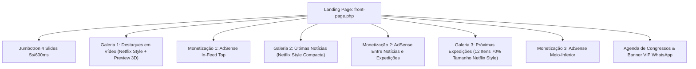

<p align="center">
  
</p>

<h1 align="center">🛸 UFOTURISMO PRO &bull; ENTERPRISE MEDIA & ANOMALOUS RESEARCH ECOSYSTEM (PT-BR)</h1>
<h3 align="center">Plataforma Modular High-Performance de Turismo Ufológico, Divulgação Científica e Monetização High-RPM</h3>

<p align="center">
  
  
  
  
  
</p>

---

## 🌟 Resumo Executivo da Release `v3.5.0-PRO` (Full Netflix & Expeditions 70% Edition)

O ecossistema **UFOTurismo PRO** alcança na **Versão 3.5.0-PRO** a unificação total de suas seções no padrão arquitetônico **Streaming Netflix-Style**, incorporando estrategicamente o **Google AdSense / Ad Manager** entre a vitrine de Notícias e o acervo de Próximas Expedições, além de otimizar os cards de Roteiros para uma escala mais ágil, dinâmica e de altíssima conversão!

---

## 💎 Novidades Arquitetônicas (v3.5.0-PRO)

### 1. 🏕️ Vitrine Netflix de Expedições (70% do Tamanho Original & Máximo 12 Roteiros)
* **Escala Ergonomicamente Otimizada (70%):** Os cards da seção *Próximas Expedições e Roteiros* deixam o antigo formato de blocos largos e pesados (3 por linha) e adotam um layout ultra-compacto com 285px de largura (exatos 70% da dimensão anterior).
* **Galeria Horizontal com 12 Expedições no Acervo:** O motor agora processa e apresenta até **12 expedições científicas brasileiras** simultâneas (desde a Serra do Itatins em Peruíbe até a Operação Prato na Amazônia e a Chapada dos Veadeiros), rolando horizontalmente sem esforço de tela via setas animadas (`⟨` e `⟩`).
* **Efeito Relief 3D On-Hover:** Ao passar o mouse sobre um roteiro, o cartão eleva-se em zoom (`scale(1.1) translateY(-6px)`), iluminando as bordas em ciano neon com botão de agendamento instantâneo.

### 2. 📢 Nova Zona Estratégica de Monetização Google AdSense
* **Injeção de Bloco Entre Notícias e Expedições:** Alinhando-se aos mapas de calor e leitura vertical da landing page, um novo container de publicidade de altíssimo engajamento foi inserido exatamente na transição entre o jornalismo científico (*Últimas Notícias e Relatos*) e os roteiros turísticos (*Próximas Expedições e Roteiros*).
* **4 Zonas Integradas:** O site passa a contar com quatro linhas mestras de anúncios, operando sem atrapalhar a estética das galerias.

### 3. 🎠 Jumbotron Dinâmico de 4 Slides & Zero Espaço Preto
* **Trocas Automáticas (5s / 600ms):** O topo exibe 4 variações atmosféricas girando de forma contínua de 5 em 5 segundos, com transições em 600ms.
* **Adesão Contínua:** Todas as seções mantêm conexão direta e sem quebras visuais (zero vácuos de cor negra ou buracos de layout).

### 4. 🎬 Preview On-Hover 3D & Idioma 100% em PT-BR
* **Vídeos Animados Ao Vivo no Hover:** Os cartazes do YouTube ocultam automaticamente sua capa de foto e iniciam a rolagem e pré-visualização contínua do episódio sem cliques no mouse.
* **Tradução Nativa e Integral:** Algoritmo dedicado elimina completamente títulos, emblemas ou descrições em inglês da interface.

---

## 📐 Fluxograma Técnico do Ecossistema (`ufoturismo-child`)



---

## 🛠️ Guia Rápido de Instalação & Git Sincronizado

1. **Subir Aplicação Completa no Docker (PowerShell Windows):**
   ```powershell
   cd C:\Users\luxx\Documents\Trampos\Guarau\UFO
   docker compose up -d
   ```
2. **Acessos Rápidos (LAN & WiFi Local):**
   * **Portal Otimizado v3.5.0:** `http://localhost:8000/` ou `http://192.168.15.3:8000/`
   * **Dashboard de Controle WordPress:** `http://localhost:8000/wp-admin/`
3. **Comando de Espelhamento GitHub:**
   ```powershell
   git add -A; git commit -m "feat(v3.5.0): convert expeditions to netflix carousel with 12 items at 70% size and insert adsense between news and expeditions"; git push
   ```

---

<p align="center">
  <b>Engenharia de Software Exclusiva &bull; Desenvolvida com Antigravity & AI Pair Programming</b><br>
  <i>"A Verdade Está Lá Fora. E Nós Levamos Você Até Ela."</i> 🛸🇧🇷🖖
</p>
