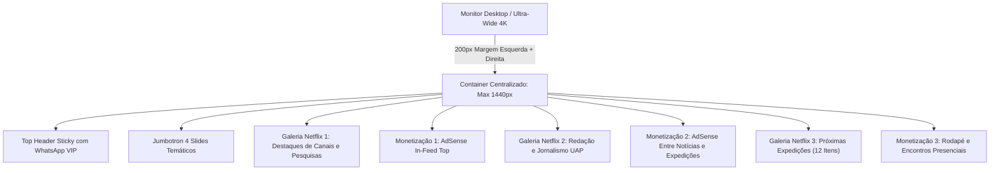

<p align="center">
  
</p>

<h1 align="center">🛸 UFOTURISMO PRO &bull; ENTERPRISE MEDIA & ANOMALOUS RESEARCH ECOSYSTEM (PT-BR)</h1>
<h3 align="center">Plataforma Modular High-Performance de Turismo Ufológico, Divulgação Científica e Monetização High-RPM</h3>

<p align="center">
  
  
  
  
  
</p>

---

## 🌟 Resumo Executivo da Release `v3.6.0-PRO` (1440px Max-Width & 200px Lateral Margins Edition)

A plataforma **UFOTurismo PRO** alcança um novo patamar de requinte arquitetônico na **Versão 3.6.0-PRO**. Esta atualização reestiliza de forma global a estrutura de grid e recipientes de todas as páginas da plataforma, determinando uma **Largura Máxima de 1440 pixels** conjugada com uma **Margem Lateral de 200 pixels em cada lado** das páginas em monitores desktop de alto padrão!

---

## 💎 Novidades Arquitetônicas (v3.6.0-PRO)

### 1. 📐 Padronização Global de Layout (1440px Max & 200px Margins)
* **Ergonomia Visual Premium (200px Leste/Oeste):** Em todas as páginas (Home, Central de Notícias, Acervo de Vídeos, Página de Roteiros, Artigos Individuais e Fórum), as laterais exibem uma margem de respiro limpa de exatos 200px de cada lado (`width: calc(100% - 400px)`), focando a atenção do visitante no conteúdo centralizado e nos banners de monetização.
* **Teto Arquitetônico (1440px):** A largura máxima de visualização de conteúdo é rigidamente delimitada em `1440px !important`, impedindo o estiramento de textos ou imagens mesmo em monitores Ultra-Wide e displays 4K de estúdio.
* **Alinhamento do Cabeçalho e Jumbotron:** Tanto o menu superior flutuante com pílulas em estilo fumê quanto a camada interna do Jumbotron interativo assumem precisamente a mesma linha de margem de 200px, proporcionando harmonia vertical impecável.

### 2. 🏕️ Vitrine Netflix de Expedições (70% de Tamanho & 12 Roteiros no Acervo)
* Os cards da seção *Próximas Expedições e Roteiros* operam no formato compacto com 285px de largura e foto reduzida em 70%, processando simultaneamente **até 12 expedições ufológicas de campo brasileiras**, com navegação direcional fluida através de botões animados e efeito relief 3D on-hover.

### 3. 📢 Zonas Estratégicas de Publicidade Google AdSense / Ad Manager
* **Alocação de Alto Engajamento:** Quatro zonas prontas para faturamento em alto RPM cortam as seções interativas, com destaque especial para a nova inserção publicitária centralizada entre a rolagem do Jornalismo Ufológico (*Últimas Notícias e Relatos*) e os roteiros turísticos (*Próximas Expedições e Roteiros*).

### 4. 🎠 Jumbotron Dinâmico (5s / 600ms) & Preview 3D sem Restrições
* Motor JavaScript aciona a rotação de 4 slides no Jumbotron superior de exatos 5 em 5 segundos, com transição suave em 600ms e preview mudo instantâneo dos vídeos diretamente ao passar o cursor do mouse.

---

## 📐 Fluxograma e Esquemático do Layout (`ufoturismo-child`)



---

## 🛠️ Guia de Infraestrutura & Comandos Git

1. **Ativar Contêineres no Docker (PowerShell Windows):**
   ```powershell
   cd C:\Users\luxx\Documents\Trampos\Guarau\UFO
   docker compose up -d
   ```
2. **Acesso Operacional e LAN (Rede Wi-Fi Local):**
   * **Portal Interativo v3.6.0:** `http://localhost:8000/` ou `http://192.168.15.3:8000/`
   * **Painel Administrativo WordPress:** `http://localhost:8000/wp-admin/`
3. **Sincronização com GitHub (Quando Internet Reestabelecer):**
   ```powershell
   git add -A; git commit -m "feat(v3.6.0): globally restyle layout to 1440px max-width with 200px lateral margin on each side"; git push
   ```

---

## 🚀 Kit Pronto de Deploy em Produção na Hostinger (`https://guaraufo.adzon.com.br/`)

Preparamos uma estrutura automatizada e completa com 100% das URLs, mídias e tabelas já adaptadas ao domínio oficial em produção:
* **Pasta Oficial do Pacote:** [`deploy_hostinger_guaraufo/`](file:///C:/Users/luxx/Documents/Trampos/Guarau/UFO/deploy_hostinger_guaraufo)
* **Banco de Dados Compatibilizado:** [`guaraufo_production_db.sql`](file:///C:/Users/luxx/Documents/Trampos/Guarau/UFO/deploy_hostinger_guaraufo/guaraufo_production_db.sql)
* **Tema Filho Customizado:** [`ufoturismo-child.zip`](file:///C:/Users/luxx/Documents/Trampos/Guarau/UFO/deploy_hostinger_guaraufo/ufoturismo-child.zip)
* **Acervo de Mídias e Imagens:** [`uploads-media-backup.zip`](file:///C:/Users/luxx/Documents/Trampos/Guarau/UFO/deploy_hostinger_guaraufo/uploads-media-backup.zip)
* **Manual Completo Passo a Passo para cPanel / hPanel:** 👉 [**LER O GUIA DE DEPLOY NA HOSTINGER**](file:///C:/Users/luxx/Documents/Trampos/Guarau/UFO/deploy_hostinger_guaraufo/GUIA_OFICIAL_DEPLOY_HOSTINGER.md)

---

<p align="center">
  <b>Engenharia de Software Exclusiva &bull; Desenvolvida com Antigravity & AI Pair Programming</b><br>
  <i>"A Verdade Está Lá Fora... E Agora no Domínio guaraufo.adzon.com.br!"</i> 🛸🇧🇷🖖
</p>
