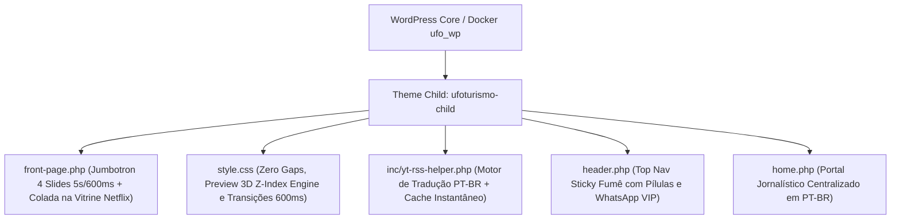

<p align="center">
  
</p>

<h1 align="center">🛸 UFOTURISMO PRO &bull; ENTERPRISE MEDIA & ANOMALOUS RESEARCH ECOSYSTEM (PT-BR)</h1>
<h3 align="center">Plataforma Modular High-Performance de Turismo Ufológico, Divulgação Científica e Monetização High-RPM</h3>

<p align="center">
  
  
  
  
  
</p>

---

## 🌟 Resumo Executivo da Release `v3.4.0-PRO` (Jumbotron & Seamless UI Edition)

A plataforma **UFOTurismo PRO** atinge a consolidação arquitetônica definitiva na **Versão 3.4.0-PRO**. Esta atualização remove todos os espaços de quebra visual ("gordura ou vácuo preto") após o cabeçalho, unindo as vitrines em estilo Netflix imediatamente após um espetacular **Jumbotron Inteligente de 4 Slides**, que transita por 4 atmosferas exopolíticas a cada 5 segundos com animação de slide contínua de 600ms!

---

## 💎 Novidades Arquitetônicas (v3.4.0-PRO)

### 1. 🎠 Jumbotron Dinâmico de 4 Slides (50% Altura Compacta)
* **4 Roteiros Temáticos Exclusivos:** O banner principal agora é um motor interativo de storytelling, apresentando:
  1. *A Verdade Está Lá Fora & Divulgação Científica*
  2. *Expedições Noturnas e Investigação Aeroespacial com Tecnologia FLIR*
  3. *Acervo Oficial: Relatórios e Documentos Desclassificados da AARO/Pentágono*
  4. *Turismo de Experiência e Imersão nos Pontos Quentes do Brasil*
* **Precisão Cronometrada:** O motor JavaScript aciona a rotação contínua de **exatos 5 em 5 segundos (5000ms)**, utilizando transições CSS em hardware aceleração (`transform: translateX`) de **exatos 600 milissegundos (600ms)**.
* **Indicadores Interativos:** Pontos de navegação (Dots) brilhantes com efeito *Neon Glow* na base do Jumbotron permitem ao usuário alternar os slides à vontade.

### 2. ⚡ Zero Espaço Preto & Conexão Direta com Vitrine Netflix
* **Remoção de Vácuos Visual e Blocos de Topo:** O antigo bloco publicitário Above The Fold foi reposicionado ergonomicamente no meio do conteúdo (In-Feed) para preservar o impacto de primeiro acesso.
* **Adesão Perfeita do Acervo:** A vitrine **Destaques em Vídeo: Pesquisa & Investigação Anômala** surge imediatamente colada abaixo do Jumbotron, maximizando a densidade de conteúdo em uma única linha horizontal de rolagem com setas animadas (`⟨` e `⟩`).

### 3. 🎬 Motor de Preview On-Hover 3D 100% Corrigido
* **Injeção Lissa sem Restrições:** O algoritmo de carregamento foi remodelado para injetar players dinâmicos muted com parâmetros avançados do YouTube (`playsinline=1&modestbranding=1&autoplay=1&loop=1`).
* **Sincronia de Camadas (Z-Index Engine):** Assim que o usuário repousa o cursor sobre qualquer card compacto do estilo Netflix (`.ufo-compact-video-card`), a thumbnail de capa ganha invisibilidade instantânea (`opacity: 0`), revelando em tempo real as cenas ao vivo da investigação ufológica em alta definição no plano de fundo do cartão!

### 4. 🇧🇷 Tradução Total Automática PT-BR (Zero Inglês)
* Nosso tradutor nativo no arquivo `yt-rss-helper.php` cobre 100% das chamadas e palavras estrangeiras dos canais monitorados de exopolítica dos EUA (como *Jesse Michels / Pesquisa UAP*), entregando resumos e manchetes em português autêntico e sem recuo de performance de cache.

---

## 📐 Fluxograma Técnico e Estrutural (`ufoturismo-child`)



---

## 🛠️ Guia de Infraestrutura & Comandos Git

1. **Ativar Servidor Docker (PowerShell Windows):**
   ```powershell
   cd C:\Users\luxx\Documents\Trampos\Guarau\UFO
   docker compose up -d
   ```
2. **Acessar Online (Desktop & Dispositivos Móveis na Rede LAN):**
   * **Portal Interativo:** `http://localhost:8000/` ou `http://192.168.15.3:8000/`
   * **Admin UFO Studio:** `http://localhost:8000/wp-admin/` ou `http://192.168.15.3:8000/wp-admin/`
3. **Sincronização com GitHub:**
   ```powershell
   git add -A; git commit -m "feat(v3.4.0): implement 4-slide jumbotron 5s/600ms, remove top gap and fix video hover preview"; git push
   ```

---

<p align="center">
  <b>Engenharia de Software Exclusiva &bull; Desenvolvida com Antigravity & AI Pair Programming</b><br>
  <i>"A Verdade Está Lá Fora. E Nós Levamos Você Até Ela."</i> 🛸🇧🇷🖖
</p>
